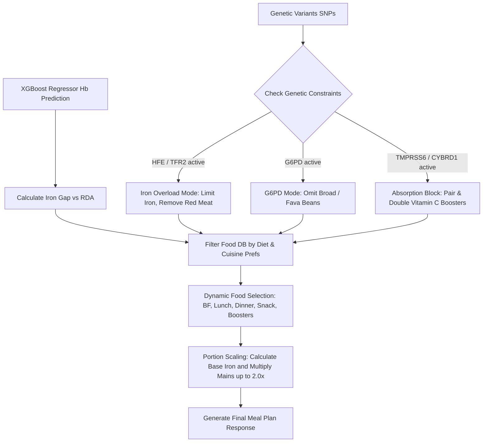

# Precision Food Recommendation System Architecture

The recommendation system consists of two primary engines working in parallel:
1. **Genomics-Informed Precision Meal Planner** (integrated within `/api/predict` / `generate_dynamic_meal_plan`)
2. **Whole-Food Dietary Framework Advisor** (served by `/api/nutrition-recommend`)

Below is the detailed breakdown of how each engine operates, processes data, and scales outputs for the final patient report.

---

## 1. Genomics-Informed Precision Meal Planner

This engine translates predicted physiological markers (Hemoglobin levels from the XGBoost Regressor) and genetic variants (SNPs) into a structured daily meal plan.

### A. Target Iron Gap Calculation
- The system determines the Recommended Dietary Allowance (RDA) for iron based on the patient's sex:
  - **Females (`RIAGENDR == 1`)**: RDA = **18 mg/day**
  - **Males (`RIAGENDR == 0`)**: RDA = **8 mg/day**
- The target daily iron gap is calculated as:
  $$\text{Iron Gap} = \text{RDA} - \text{Current Dietary Iron Intake}$$
- If the patient's current intake already exceeds the RDA, or if they are flagged for genetic iron overload risk, the iron gap is set to `0` (maintenance only).

### B. Genetic Constraints & Variant Checking
The engine scans the active genetic variants to enforce safety and bioavailability rules:
1. **Iron Overload Risk (`HFE`, `TFR2`):**
   - Active variants in these iron-sensing genes place the model in **Maintenance Mode**.
   - Heme-rich sources like beef, steak, and red meat are filtered out of the database to prevent excess systemic iron accumulation.
2. **G6PD Pathway Deficiency (`G6PD`):**
   - Active variants in the G6PD gene trigger strict safety constraints.
   - All broad beans and fava beans are completely purged from all meals to prevent triggering acute hemolytic crises.
3. **Impaired Non-Heme Absorption (`TMPRSS6`, `CYBRD1`):**
   - Active variants in these genes indicate impaired iron transportation and sensing.
   - The engine automatically pairs every iron-rich main meal with high-Vitamin-C absorption boosters (e.g., Citrus juices, bell peppers) and **doubles the booster portions** to override the genetic absorption barrier.

### C. Database Filtering & Portion Scaling
- **Dietary Filter:** The database is filtered according to the patient's preferences:
  - **Vegetarian:** Retains only vegetarian-safe items.
  - **Vegan:** Restricts to strictly plant-based items.
  - **Any:** Accesses the full database.
- **Cuisine Prioritization:** Foods matching the chosen cuisine preference (e.g., Western, Mediterranean, Asian) are sorted to the top.
- **Dynamic Portion Scaling:**
  1. The system selects a breakfast, lunch main, dinner main, snack, and three meal-paired Vitamin C boosters.
  2. It calculates the cumulative base iron value of the chosen foods.
  3. If the base iron is insufficient to meet the target gap, it calculates a portion scaling multiplier:
     $$\text{Multiplier} = \text{Round}\left(\frac{\text{Target Iron Goal}}{\text{Base Iron Plan}}\right)$$
  4. The multiplier (capped between `1.0x` and `2.0x`) is applied to scale up the portions of the lunch and dinner mains, dynamically satisfying the iron deficit.

---

## 2. Whole-Food Dietary Framework Advisor

This advisor processes general dietary patterns, food intolerances, and macronutrient habits to generate whole-food inclusions, exclusions, and behavioral advice.

### A. Allergen & Diet Filtering
- The system checks the ingredient list against the patient's reported allergies (e.g., Dairy, Eggs, Soy, Gluten, Nuts).
- Any food item containing matching allergens is removed from the recommendation pool.
- Animal-derived foods are excluded based on the selected diet type (**Vegan** or **Vegetarian**).

### B. Macronutrient Pattern Mapping & Sorting
The advisor modifies recommendations dynamically based on the patient's intake habits:
- **High Carb / High Refined Sugar Pattern:**
  - Adds refined grains, white pasta, and sugary cereals to the avoidance list.
  - Prioritizes high-protein and high-fiber foods to support insulin sensitivity and prevent blood sugar spikes.
- **High Saturated Fat Pattern:**
  - Filters out high-saturated fats (cheese, butter, fried foods).
  - Prioritizes heart-healthy unsaturated fats (Avocado, Chia Seeds, Extra Virgin Olive Oil).
- **Low Carb Pattern:**
  - Purges high-starch carbohydrates (potatoes, rice, bread) from recommended lists.
  - Emphasizes protein-dense and fat-dense options.
- **High Protein Pattern:**
  - Prioritizes amino-acid-dense options (e.g., Tofu, Tempeh, Salmon, Egg Whites) to support cellular repair.

### C. Calorie and Behavioral Guidelines
- Estimates appropriate daily caloric ranges based on the selected pattern:
  - **Low Carb:** 1500–1700 kcal/day (insulin optimization)
  - **High Protein:** 2000–2200 kcal/day (anabolic/repair support)
  - **High Fat:** 1700–1900 kcal/day (caloric maintenance)
  - **Balanced:** 1800–2000 kcal/day (standard metabolic baseline)
- Synthesizes personalized behavioral advice, such as chewing speeds, hydration rules, and eating windows, based on the customer's habits.
